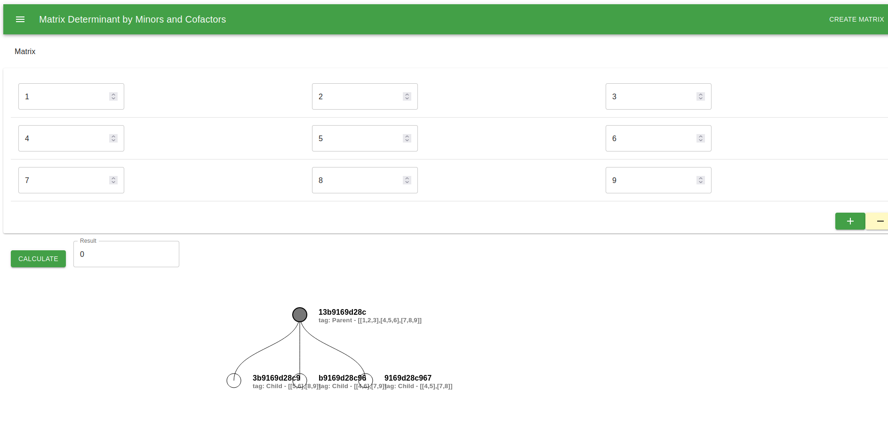

# Programa para calcular la determinante por medio de menores y cofactores, además de obtener su árbol de ejecución (Español).

## Introducción

El presente programa busca resolver la determinante de una matriz cuadrada mediante él suso de menores y cofactores, además de generar el árbol de ejecución de cada una de las submatrices que genera.

## Algoritmo 
El método de los menores y cofactores es un enfoque utilizado para calcular el determinante de una matriz cuadrada. El proceso se basa en la descomposición de la matriz original en submatrices más pequeñas, conocidas como menores, y en el cálculo de los cofactores correspondientes a esos menores.

El procedimiento general del método de los menores y cofactores es el siguiente:

Dada una matriz cuadrada de tamaño $n x n$, se selecciona una fila o columna de la matriz para realizar el cálculo del determinante. Esto se puede hacer de manera arbitraria.

Para cada elemento de la fila o columna seleccionada, se calcula el menor asociado eliminando la fila y columna correspondientes a ese elemento.

A cada menor se le asigna un cofactor, que se obtiene multiplicando el menor por $(-1)^(i + j)$, donde $i$ es el número de fila y $j$ es el número de columna del elemento en cuestión.

Se calcula el determinante sumando los productos de los elementos de la fila o columna seleccionada por sus respectivos cofactores.

Si se seleccionó una fila para el cálculo del determinante, se utiliza la fórmula:
 ${determinante} = a_1 * C_1 + a_2 * C_2 + ... + a_n * C_n$,
donde ai son los elementos de la fila seleccionada y $C_i$ son sus respectivos cofactores.

Si se seleccionó una columna para el cálculo del determinante, se utiliza la fórmula:
${determinante} = a_1 * C_1 + b_1 * C_2 + ... + n_1 * C_n$,
donde ai son los elementos de la columna seleccionada y Ci son sus respectivos cofactores.

Se repite el proceso recursivamente para calcular los determinantes de los menores de orden inferior hasta llegar a matrices 2x2, para las cuales se puede aplicar la fórmula directa.

Finalmente, se obtiene el determinante completo de la matriz original.

Es importante destacar que este método puede ser computacionalmente costoso para matrices grandes debido a la necesidad de calcular determinantes de menores de orden inferior de manera recursiva. Por lo tanto, existen métodos más eficientes para el cálculo de determinantes en matrices de mayor tamaño, como la eliminación de Gauss o la descomposición LU.

## Ejemplo del árbol de ejecucción

# Program to calculate the determinant by means of minors and cofactors, in addition to obtaining its execution tree (English).

## Introduction

This program seeks to solve the determinant of a square matrix through the use of minors and cofactors, in addition to generating the execution tree of each of the submatrices that it generates.

## Algorithm
The method of minors and cofactors is an approach used to calculate the determinant of a square matrix. The process is based on decomposing the original matrix into smaller submatrices, known as minors, and calculating the cofactors corresponding to those minors.

The general procedure of the method of minors and cofactors is as follows:

Given a square matrix of size $n x n$, a row or column of the matrix is selected to perform the calculation of the determinant. This can be done arbitrarily.

For each element in the selected row or column, the associated minor is calculated by removing the row and column corresponding to that element.

Each minor is assigned a cofactor, which is obtained by multiplying the minor by $(-1)^(i + j)$, where $i$ is the row number and $j$ is the column number of the element in question.

The determinant is calculated by adding the products of the elements of the selected row or column by their respective cofactors.

If a row was selected for the calculation of the determinant, the formula is used:
  ${determinant} = a_1 * C_1 + a_2 * C_2 + ... + a_n * C_n$,
where ai are the elements of the selected row and $C_i$ are their respective cofactors.

If a column was selected for the calculation of the determinant, the formula is used:
${determinant} = a_1 * C_1 + b_1 * C_2 + ... + n_1 * C_n$,
where ai are the elements of the selected column and Ci are their respective cofactors.

The process is repeated recursively to calculate the determinants of lower order minors until arriving at 2x2 matrices, for which the direct formula can be applied.

Finally, the complete determinant of the original matrix is obtained.

It is important to note that this method can be computationally expensive for large matrices due to the need to compute lower order determinants recursively. Therefore, there are more efficient methods for calculating determinants on larger matrices, such as Gaussian elimination or LU decomposition

## Execution Tree Example

# Acerca del autor / About the author

* Estuandite de Doctorado: Juan Carlos Moreno Sanchez 
* carlos.moreno.phd@gmail.com
* jcmorenos@alumno.uaemex.mx